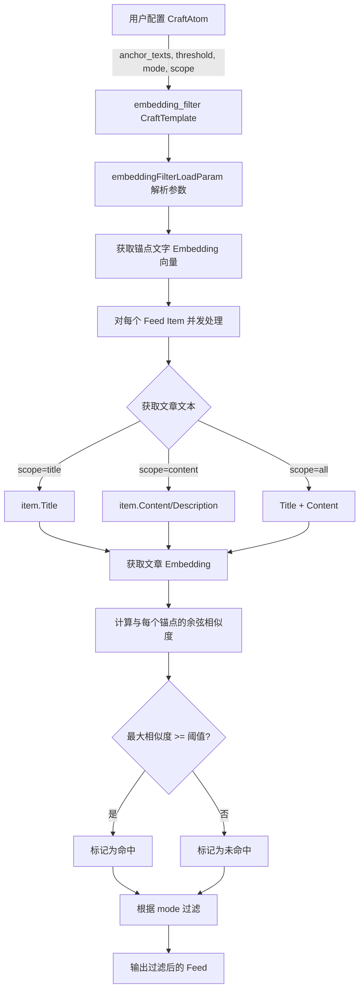
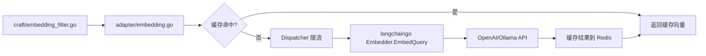

## 产品概述

在 FeedCraft 现有 Craft 插件体系中新增一个基于 Embedding 模型的语义过滤插件（`embedding-filter`），实现零样本分类能力。用户无需训练模型，只需定义若干"锚点文字"（anchor texts），系统即可通过向量相似度自动判断 RSS 条目是否与目标主题相关。

## 核心功能

1. **语义向量过滤**：利用 Embedding 模型将 RSS 条目文本和用户定义的锚点文字分别编码为向量，通过余弦相似度进行匹配判定
2. **锚点文字机制**：用户可定义多个锚点文字（如"人工智能,深度学习,大模型"），RSS 条目与任意一个锚点文字的相似度超过阈值即判定命中
3. **双向过滤模式**：支持 `include`（保留命中条目）和 `exclude`（排除命中条目）两种模式
4. **匹配范围控制**：支持对标题（title）、正文（content）或全部（all）进行匹配
5. **Instruction 兼容**：提供可选的 `instruction` 参数，通过前缀拼接方式兼容支持 instruction 的模型（如 mxbai-embed-large）和不支持的模型（如 text-embedding-3-small）
6. **Embedding 模型独立配置**：通过独立环境变量配置 Embedding 模型端点，支持与 Chat 模型使用不同的 API 提供方和模型
7. **向量缓存**：对锚点文字和文章内容的 Embedding 结果进行 Redis 缓存，避免重复 API 调用

## 技术栈

- 后端语言：Go 1.24
- Web 框架：Gin
- Embedding 库：`github.com/tmc/langchaingo v0.1.14`（已在 go.mod 中，其 `embeddings` 子包提供 `Embedder` 接口和 `NewEmbedder` 构造函数）
- 向量客户端：复用 `langchaingo/llms/openai` 和 `langchaingo/llms/ollama`（均实现 `embeddings.EmbedderClient` 接口）
- 缓存：Redis（复用现有 `util.CachedFunc` 和 `CacheSetString/CacheGetString`）
- 并发控制：复用现有 `util.PriorityDispatcher`
- 前端：无需修改（现有 CraftAtom 编辑界面会自动根据 `listCraftTemplates()` API 生成参数表单）

## 实现方案

### 核心策略

采用"Adapter 层封装 + Craft 层过滤"的两层架构。Adapter 层负责 Embedding 客户端管理、API 调用和向量缓存；Craft 层负责参数解析、文本预处理、相似度计算和过滤逻辑。整个实现作为一个新的 CraftTemplate 注册到现有体系中，完全遵循现有的 Template -> Atom -> Flow -> Recipe 架构。

### 关键技术决策

**1. Embedding 客户端构建方式**

直接复用 `langchaingo` 的 `openai.New()` / `ollama.New()` 创建 LLM 客户端，然后通过 `embeddings.NewEmbedder(client)` 包装为 Embedder。这样可以完全复用现有的客户端创建逻辑（`common_llm.go` 中的模式），只需将 model 参数替换为 Embedding 模型名称。

使用独立的环境变量组 `FC_EMBEDDING_API_*`，回退到 `FC_LLM_API_*`，因为 Embedding 模型和 Chat 模型通常不同（如 `text-embedding-3-small` vs `gpt-4o`）。

**2. Instruction 兼容方案**

提供 `instruction_for_query` 和 `instruction_for_doc` 两个可选参数。如果用户配置了 instruction，在调用 Embedding API 前将 instruction 作为前缀拼接到文本中（格式：`instruction + ": " + text`）。这是社区通用做法（如 MTEB benchmark 中的标准方式），无需修改底层 API，对不支持 instruction 的模型则留空即可。

**3. 向量缓存策略**

- 锚点文字的 Embedding 以 `embedding_anchor_{model}_{md5(instruction+text)}` 为 key 缓存到 Redis，TTL 7 天（复用 `constant.WebContentExpire`）
- 文章内容的 Embedding 以 `embedding_doc_{model}_{md5(instruction+text)}` 为 key 缓存
- 缓存序列化使用 JSON 编码 `[]float32` 切片
- 这样同一篇文章在不同 Craft 中只需编码一次

**4. 并发与性能**

- 锚点文字数量少（通常 < 10），在 CraftOption 初始化时一次性批量获取其 Embedding，不走并发调度
- 文章 Embedding 使用 `parallel.Map` 并发获取（复用 `llm_filter.go` 的模式），内部通过 `PriorityDispatcher` 限流
- 余弦相似度为纯 CPU 计算（O(n) 每对向量），无性能瓶颈

**5. 过滤执行模式**

完全参照 `keyword.go` 的过滤模式（include/exclude + scope）和 `llm_filter.go` 的并发模式（`parallel.Map` + `lo.Filter`），确保架构一致性。

## 实现注意事项

- Embedding 客户端使用 `sync.Map` 做单例缓存（与 `common_llm.go` 中 `llmClients` 模式一致），避免重复创建
- 文本预处理：文章内容先用 `util.ProcessContent` 去除图片、转 Markdown，再截断到合理长度（8192 tokens 近似按字符截断），防止超出 Embedding 模型的 context window
- 空向量保护：如果 Embedding API 返回空向量或维度不匹配，跳过该条目并记录 warning，不中断整个 feed 处理
- 阈值默认值设为 0.75，这是 text-embedding-3-small 等模型在语义匹配任务中的经验值

## 架构设计

### 数据流



### Embedding 调用链



## 目录结构

```
internal/
├── adapter/
│   └── embedding.go           # [NEW] Embedding 适配器层。封装 Embedding 客户端创建（复用 langchaingo openai/ollama）、
│                               #       环境变量读取（FC_EMBEDDING_API_* 回退 FC_LLM_API_*）、客户端 sync.Map 缓存、
│                               #       PriorityDispatcher 限流、Redis 向量缓存、instruction 前缀拼接逻辑。
│                               #       导出函数：GetEmbedding(ctx, text, instruction) ([]float32, error)、
│                               #       GetEmbeddings(ctx, texts, instruction) ([][]float32, error)、
│                               #       CosineSimilarity(a, b []float32) float64
├── craft/
│   ├── embedding_filter.go    # [NEW] Embedding 过滤 Craft 实现。定义参数模板 embeddingFilterParamTmpl、
│   │                          #       参数加载函数 embeddingFilterLoadParam、过滤核心函数 OptionEmbeddingFilter。
│   │                          #       参数：anchor_texts（逗号分隔）、similarity_threshold（默认 0.75）、
│   │                          #       mode（include/exclude）、scope（title/content/all）、
│   │                          #       instruction_for_query（可选）、instruction_for_doc（可选）。
│   │                          #       过滤逻辑：并发获取文章 Embedding，与锚点向量计算余弦相似度，按阈值+模式过滤。
│   ├── embedding_filter_test.go # [NEW] 单元测试。覆盖余弦相似度计算、参数解析、include/exclude 模式、
│   │                            #       scope 选择、instruction 拼接逻辑。使用 mock Embedder 避免外部依赖。
│   └── entry.go               # [MODIFY] 在 GetSysCraftTemplateDict() 中第 132 行 return 前添加
│                               #          "embedding-filter" 模板注册（约 4 行代码）。
```

## 关键代码结构

```
// internal/adapter/embedding.go - 核心接口

// GetEmbedding 获取单个文本的 Embedding 向量（带缓存和 instruction 支持）
func GetEmbedding(ctx context.Context, text string, instruction string) ([]float32, error)

// GetEmbeddings 批量获取多个文本的 Embedding 向量
func GetEmbeddings(ctx context.Context, texts []string, instruction string) ([][]float32, error)

// CosineSimilarity 计算两个向量的余弦相似度，返回 [-1, 1] 范围的 float64
func CosineSimilarity(a, b []float32) float64
```

```
// internal/craft/embedding_filter.go - 参数模板

var embeddingFilterParamTmpl = []ParamTemplate{
    {Key: "anchor_texts", Description: "锚点文字列表，用逗号分隔。RSS 条目与任意锚点相似度超过阈值即命中。例：`人工智能,深度学习,大模型`"},
    {Key: "similarity_threshold", Description: "相似度阈值 (0-1)，超过此值判定命中", Default: "0.75"},
    {Key: "mode", Description: "过滤模式：`include`(保留命中) 或 `exclude`(排除命中)", Default: "include"},
    {Key: "scope", Description: "匹配范围：`title`(仅标题)、`content`(仅正文)、`all`(标题+正文)", Default: "all"},
    {Key: "instruction_for_query", Description: "（可选）锚点文字的 instruction 前缀，用于支持 instruction-based 模型（如 mxbai-embed-large）。不支持的模型留空即可"},
    {Key: "instruction_for_doc", Description: "（可选）文章文本的 instruction 前缀"},
}
```

## Agent Extensions

### SubAgent

- **code-explorer**
- Purpose: 在实现阶段深入探索 `langchaingo/embeddings` 包的具体用法、`openai.Option` 中与 Embedding 相关的选项、以及 `ollama` 包的 Embedding 支持细节
- Expected outcome: 确认 `openai.WithEmbeddingModel()` 选项是否存在，以及 Ollama 客户端是否需要特殊配置来支持 Embedding 调用
